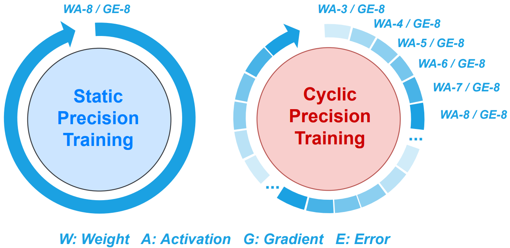
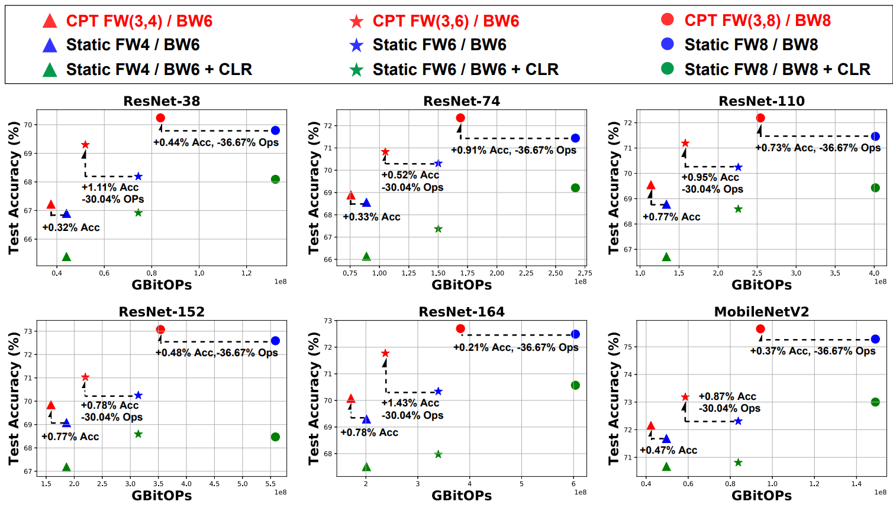
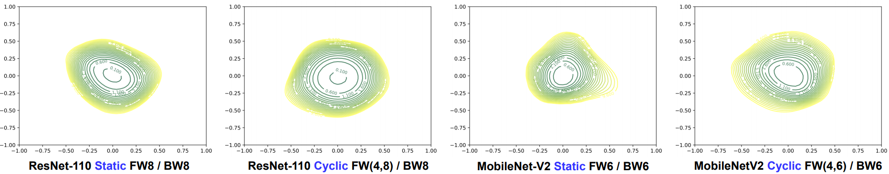
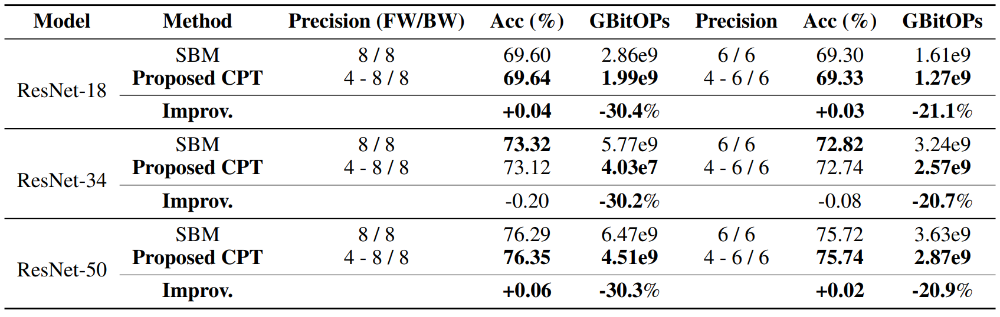
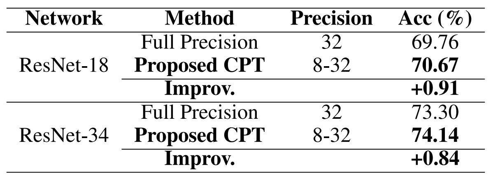
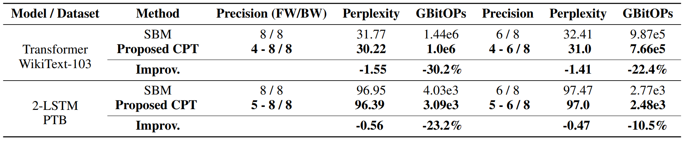

# CPT: Efficient Deep Neural Network Training via Cyclic Precision
***Yonggan Fu***, Han Guo, Meng Li, Xin Yang, Yining Ding, Vikas Chandra, Yingyan Lin

Accepted at ICLR 2021 (Spotlight) [[Paper Link]](https://openreview.net/pdf?id=87ZwsaQNHPZ).

## Overview
Low-precision deep neural network (DNN) training has gained tremendous attention as reducing precision is one of the most effective knobs for boosting DNNs’ training time/energy efficiency. In this paper, we attempt to explore low-precision training from a new perspective as inspired by recent findings in understanding DNN training: we conjecture that DNNs’ precision might have a similar effect as the learning rate during DNN training, and advocate dynamic precision along the training trajectory for further boosting the time/energy efficiency of DNN training. Specifically, we propose ***Cyclic Precision Training (CPT)*** to cyclically vary the precision between two boundary values to balance the *coarse-grained exploration of low precision* and *fine-grained optimization of high precision*. Through experiments and visualization we show that CPT helps to (1) converge to a wider minima with a lower generalization error and (2) reduce training variance, which opens up a new design knob for simultaneously improving the optimization and efficiency of DNN training.

<p align="center">
  
</p>

## Experimental Results
We evaluate ***CPT*** on eleven models & five datasets (i.e., ResNet-38/74/110/152/164/MobileNetV2 on CIFAR-10/100, ResNet-18/34/50 on ImageNet, Transformer on WikiText-103, LSTM on PTB). Please refer to [our paper](https://openreview.net/pdf?id=87ZwsaQNHPZ) for more results.


### Results on CIFAR-100
- Test accuracy vs. training computational cost
<p align="center">
  
</p>


- Loss landscape visualization

<p align="center">
  
</p>


### Results on ImageNet
- Accuracy - training efficiency trade-off
<p align="center">
  
</p>


- Boosting optimality
<p align="center">
  
</p>


### Results on WikiText-103 and PTB
<p align="center">
  
</p>


## Code Usage
`cpt_cifar` and `cpt_imagenet` are the codes customized for CIFAR-10/100 and ImageNet, respectively, with a similar code structure. 

### Prerequisites
See `env.yml` for the complete conda environment. Create a new conda environment:
```
conda env create -f env.yml
conda activate pytorch
```

### Training on CIFAR-10/100 with CPT

In addition to the commonly considered args, e.g., the target network, dataset, and data path via `--arch`, `--dataset`, and `--datadir`, respectively, you also need to: (1) enable cyclic precision training via `--is_cyclic_precision`; (2) specify the precision bounds for both forward (weights and activations) and backward (gradients and errors) with `--cyclic_num_bits_schedule` and `--cyclic_num_grad_bits_schedule`, respectively (note that in CPT, we adopt a constant precision during backward for more stable training process as analyzed in our appendix); (3) specify the number of cyclic periods via `--num_cyclic_period` which can be set as 32 in all experiments and more ablation studies can be found in Sec. 4.3 of [our paper](https://openreview.net/pdf?id=87ZwsaQNHPZ).

- Example: Training ResNet-74 on CIFAR-100 with CPT (3~8-bit forward, 8-bit backward, and a cyclic periods of 32).
```
cd cpt_cifar
python train.py --save_folder ./logs --arch cifar100_resnet_74 --workers 4 --dataset cifar100 --datadir path-to-cifar100 --is_cyclic_precision --cyclic_num_bits_schedule 3 8 --cyclic_num_grad_bits_schedule 8 8 --num_cyclic_period 32
```

We also integrate [SWA](http://proceedings.mlr.press/v97/yang19d/yang19d.pdf) in our code although it is not used in the reported results of our paper.


### Training on ImageNet with CPT
The args for ImageNet experiments are similar with the ones on CIFAR-10/100.

- Example: Training ResNet-34 on ImageNet with CPT (3~8-bit forward, 8-bit backward, and a cyclic periods of 32).
```
cd cpt_imagenet
python train.py --save_folder ./logs --arch resnet34 --warm_up --datadir PATH_TO_IMAGENET --is_cyclic_precision --cyclic_num_bits_schedule 3 8 --cyclic_num_grad_bits_schedule 8 8 --num_cyclic_period 32 --automatic_resume
```

## Citation
```
@article{fu2021cpt,
  title={CPT: Efficient Deep Neural Network Training via Cyclic Precision},
  author={Fu, Yonggan and Guo, Han and Li, Meng and Yang, Xin and Ding, Yining and Chandra, Vikas and Lin, Yingyan},
  journal={arXiv preprint arXiv:2101.09868},
  year={2021}
}
```

## Our Related Work
Please also check our work on how to fractionally squeeze out more training cost savings from the most redundant bit level, progressively along the training trajectory and dynamically per input:

**Yonggan Fu, Haoran You, Yang Zhao, Yue Wang, Chaojian Li, Kailash Gopalakrishnan, Zhangyang Wang, Yingyan Lin. "FracTrain: Fractionally Squeezing Bit Savings Both Temporally and Spatially for Efficient DNN Training". *NeurIPS*, 2020.**
\[[Paper Link](https://papers.nips.cc/paper/2020/file/8dc5983b8c4ef1d8fcd5f325f9a65511-Paper.pdf)\] \[[Code](https://github.com/RICE-EIC/FracTrain)\]
